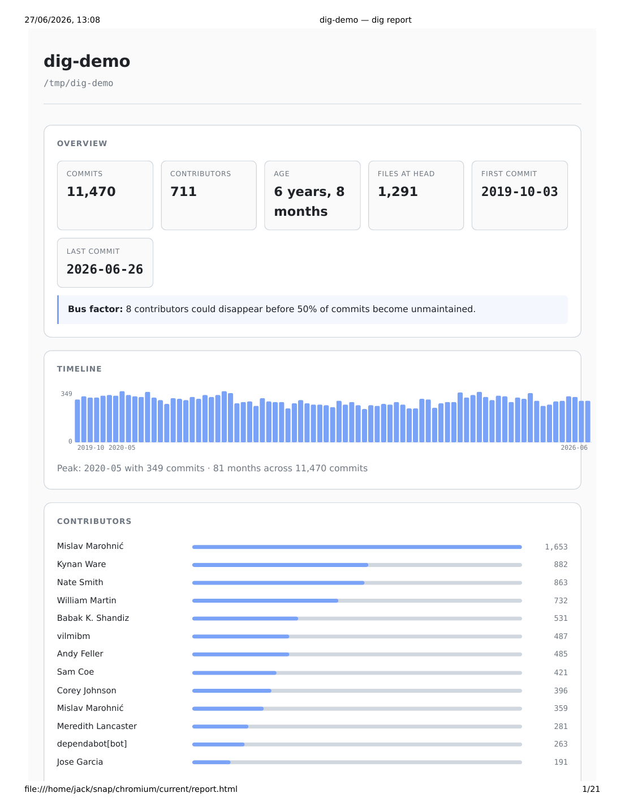

# dig

🔍 A single static Go binary that turns any git repository into a self-contained
HTML code-archaeology report.

```text
$ dig --out report.html ../some-repo
$ open report.html
```

Note: flags must come before the positional `<repo-path>` argument (standard
Go flag behaviour).

One HTML file. Zero network. Zero CDN. Zero JS framework. The report works
offline, can be emailed as an attachment, and renders the same in any modern browser.



*Above: `dig` rendered against [cli/cli](https://github.com/cli/cli) — the
official GitHub command-line tool. 11,470 commits, 711 contributors, 81
months of activity, bus factor 8.*

## What you get

A single `report.html` containing:

- **Project header** — name, age, total commits, contributors, file count,
  dominant language.
- **Timeline** — commit activity per month across the repo's lifetime.
- **Contributors** — table sorted by commit share, with a horizontal bar
  visualisation.
- **Bus factor** — the smallest set of contributors whose removal would
  orphan >50% of recent commits. Honest definition; see
  [`docs/spec.md`](./docs/spec.md).
- **Hot files** — the files touched most often across all refs. If it breaks,
  who do you call.
- **Languages** — file-extension histogram with line counts.
- **First commit** — verbatim message plus a `--stat` of the day-one tree, so
  you can see what the project looked like at the start.
- **Latest commit** — the same, for "where we are now."
- **README excerpt** — the first 80 non-empty lines of the project's README
  if one exists.

## Install

```sh
go install github.com/NovaLux12/dig@latest
```

Or build from source:

```sh
git clone https://github.com/NovaLux12/dig
cd dig && go build -o dig .
```

Requires Go 1.22+ and a `git` binary on `$PATH`.

## Usage

```sh
dig <repo-path>                             # writes dig-report.html in CWD
dig --out report.html <repo-path>           # custom output path
dig --accent #ff5577 <repo-path>            # custom accent colour
dig --since 12mo <repo-path>                # restrict analysis window
dig --help
```

`dig` is read-only. It never modifies, stages, or commits anything in the
target repo.

Exit codes: `0` success, `1` not a git repo, `2` git not installed, `3` other I/O.

## Design

Single static binary, stdlib only (no `go-git`, no template engines, no
Chart.js). All HTML, CSS, and SVG is generated in-process and embedded in
the output file. The `git` binary is the source of truth for diff parsing
and rename detection.

See [`docs/spec.md`](./docs/spec.md) for the full design.

## Why

Code archaeology is a real thing. When you join a project, or come back to
one after a year away, or take over maintenance, the first questions are
always the same: *who else knows this code? what's been hot lately? what's
the bus factor? what did this thing look like on day one?*

Most answers are scattered across git log, GitHub's UI, `git blame`, and
institutional memory. `dig` pulls them into one page.

## License

MIT. See [`LICENSE`](./LICENSE).

## Related

- [`NovaLux12/agent-card`](https://github.com/NovaLux12/agent-card) — a
  portable identity standard for AI agents.
- [`NovaLux12/operating-notes`](https://github.com/NovaLux12/operating-notes) —
  reusable patterns extracted from real investigations.
- [`NovaLux12/case-studies`](https://github.com/NovaLux12/case-studies) —
  long-form writeups of those investigations.